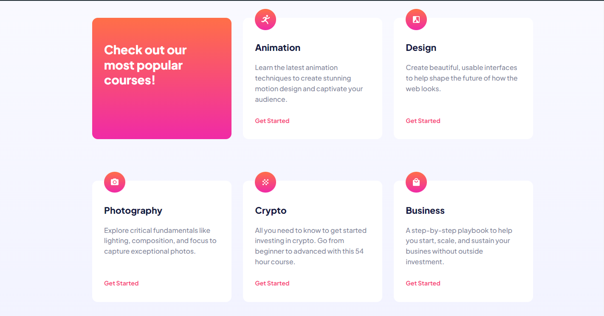
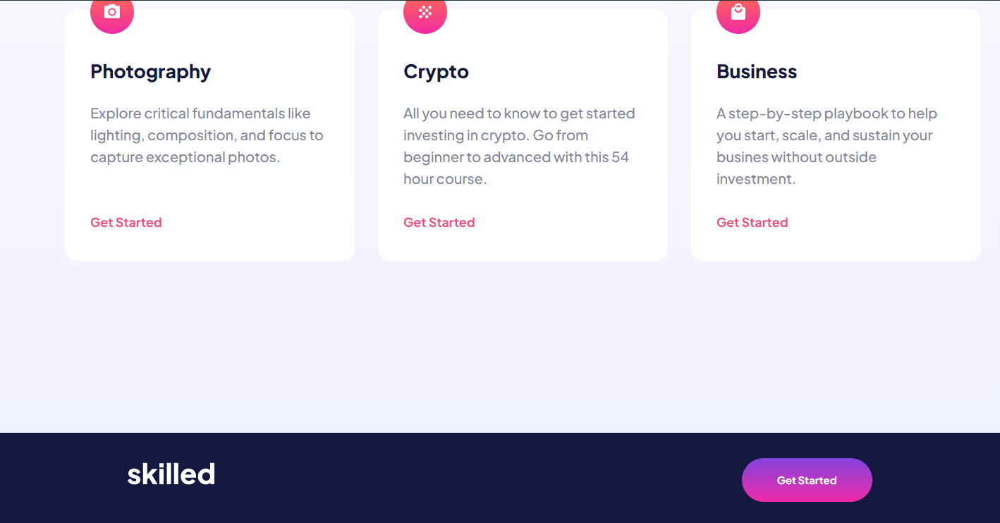
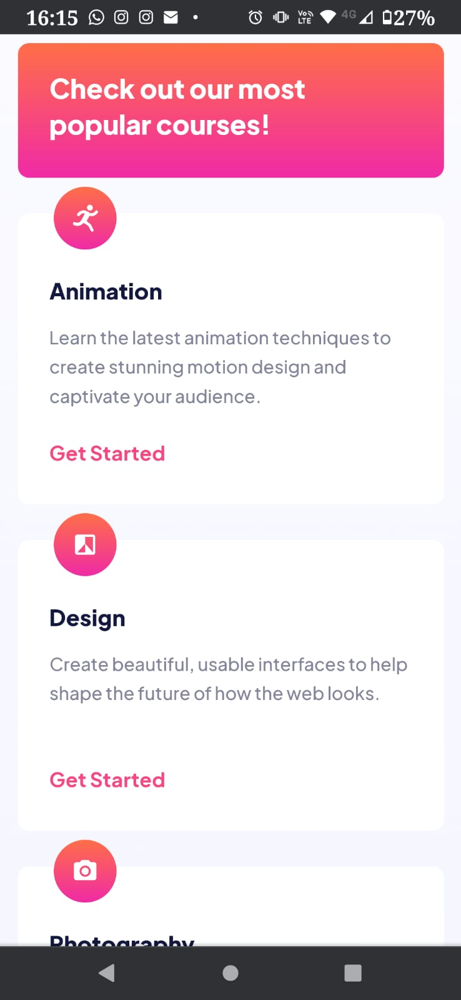
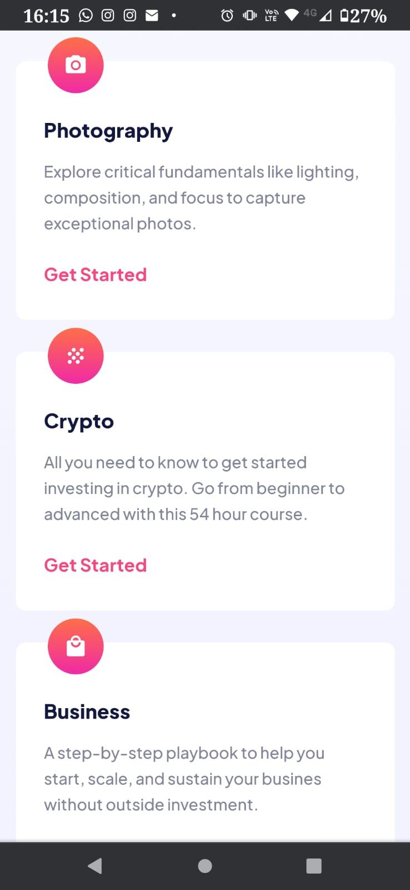
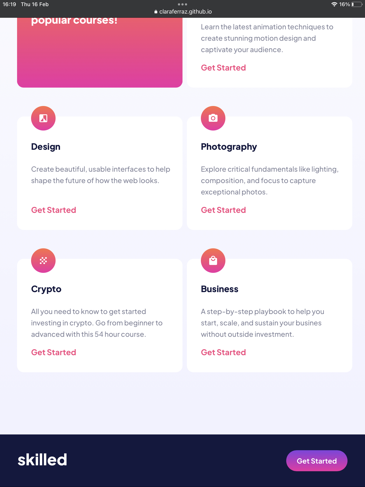

# Frontend Mentor - Skilled e-learning landing page solution

This is a solution to the [Skilled e-learning landing page challenge on Frontend Mentor](https://www.frontendmentor.io/challenges/skilled-elearning-landing-page-S1ObDrZ8q). Frontend Mentor challenges help you improve your coding skills by building realistic projects.

## Table of contents

- [Overview](#overview)
  - [The challenge](#the-challenge)
  - [Screenshot](#screenshot)
  - [Links](#links)
- [My process](#my-process)
  - [Built with](#built-with)
  - [What I learned](#what-i-learned)
  - [Useful resources](#useful-resources)
- [Author](#author)
- [Acknowledgments](#acknowledgments)

## Overview

### The challenge

Users should be able to:

- View the optimal layout depending on their device's screen size
- See hover states for interactive elements

### Screenshot











### Links

- Solution URL: [](https://github.com/claraferraz/skilled-elearning-landing-page)
- Live Site URL: [](https://claraferraz.github.io/skilled-elearning-landing-page/)

## My process

### Built with

- Semantic HTML5 markup
- CSS custom properties
- Flexbox
- CSS Grid
- desktop-first workflow
- [CSS-Tricks](https://css-tricks.com/snippets/css/complete-guide-grid/) for grid guidance

### What I learned

I learned and practiced how to work with grids, background position and how to put different fonts on my code. I also learned that it would have been easier if I had made a mobile-first workflow, but unfortunatelly that wasn't the case. My HTML was pretty simple, the CSS was the one that I practiced the most.

Different fonts:

```html
<head>
  <link rel="preconnect" href="https://fonts.googleapis.com" />
  <link rel="preconnect" href="https://fonts.gstatic.com" crossorigin />
  <link
    href="https://fonts.googleapis.com/css2?family=Plus+Jakarta+Sans:wght@500;700;800&display=swap"
    rel="stylesheet"
  />
</head>
```

Grid for desktop:

```css
.bottom {
  display: grid;
  width: 1110px;
  margin: 0px auto 140px auto;
  grid-template-columns: 33.33% 33.33% 33.33%;
  gap: 30px;
}
```

Grid for tablet:

```css
.bottom {
  width: 100%;
  padding: 0px 39px 86px 39px;
  grid-template-columns: 50% 50%;
  gap: 10px;
  margin: 0px;
}
```

Grid for mobile:

```css
.bottom {
  width: 100%;
  padding: 0 0 80px 0;
  grid-template-columns: 100%;
  gap: 0px;
  margin: 0px;
}
```

Background positions:

```css
.top {
  position: relative;
  top: 0px;
  background-image: url(assets/image-hero-desktop.png);
  background-repeat: no-repeat;
  background-size: 991.63px 936.91px;
  background-position: top -146.13px right -335.63px;
  width: 100%;
  height: 837px;
  padding: 252px 0px 226px 165px;
}
```

### Useful resources

- [A Complete Guide to CSS Grid](https://css-tricks.com/snippets/css/complete-guide-grid/) - This helped me understand better how a gird works.

## Author

- Website - [Clara Ferraz](https://github.com/claraferraz)
- Frontend Mentor - [@yourusername](https://www.frontendmentor.io/profile/claraferraz)

## Acknowledgments

Thanks again André for mentoring me whenever I got stuck on this project and doubting myself.
